<p align="center">
  
</p>

<h1 align="center">Shadow Software Crypto for WooCommerce</h1>

<p align="center">
  <strong>A simple, free, open-source plugin to confirm common blockchain transactions
  (USDT / USDC / BTC / ETH) and mark orders paid in WooCommerce.</strong><br>
  Customers pay your own wallets directly — payments are confirmed on-chain with free
  public tools. No middleman, no fees, no keys on your server.
</p>

<p align="center">
  <a href="https://wordpress.org/plugins/shadow-software-crypto-for-woocommerce/"></a>
  <a href="https://wordpress.org/plugins/shadow-software-crypto-for-woocommerce/"></a>
  <a href="https://github.com/shadow-software/crypto-for-woocommerce/releases/latest"></a>
  <a href="https://github.com/shadow-software/crypto-for-woocommerce/actions/workflows/ci.yml"></a>
  
  
  
  
  
</p>

<p align="center">
  <b><a href="https://wordpress.org/plugins/shadow-software-crypto-for-woocommerce/">Get it on WordPress.org →</a></b>
  &nbsp;·&nbsp;
  <a href="https://github.com/shadow-software/crypto-for-woocommerce/releases/latest">Download the latest ZIP</a>
  &nbsp;·&nbsp;
  <a href="#installation">Installation</a>
</p>

<p align="center">
  <b>Built &amp; maintained by <a href="https://shadowsoftware.com/">Shadow Software</a></b> —
  a WordPress &amp; WooCommerce development studio. <a href="https://shadowsoftware.com/">Need a custom store? Let's talk. →</a>
</p>

---

## Why this plugin

Most "crypto for WooCommerce" plugins route your customers through a hosted
gateway that holds the funds, takes a cut, and needs an account. **This one
doesn't.** You enter your own wallet addresses, customers pay them directly, and
the plugin reads the blockchain — with free public nodes and explorers — to
confirm each payment before the order is marked paid.

- 🔐 **Self-custodial.** Funds go straight to your wallets. The plugin never
  holds money and never sees a private key.
- 💸 **No fees, no middleman, no account.** Nothing takes a cut of your sales.
- 🆓 **Free tools only.** Free public RPC nodes (EVM) and block explorers
  (Bitcoin), and a free price API. Bring your own endpoints if you prefer.
- ⛓️ **On-chain verified.** An order completes only after the exact payment is
  found on-chain with the confirmations you require — never from the browser
  alone.
- 🪙 **Multi-asset, multi-network.** ETH, USDC and USDT across Ethereum, Base,
  Arbitrum One and OP Mainnet, plus native Bitcoin — each individually toggleable.

## Supported payments

| Asset | Networks | Verified via |
| ----- | -------- | ------------ |
| **ETH** (native) | Ethereum · Base · Arbitrum One · OP Mainnet | free public JSON-RPC nodes |
| **USDC** (ERC-20) | Ethereum · Base · Arbitrum One · OP Mainnet | `Transfer` event logs |
| **USDT** (ERC-20) | Ethereum · Arbitrum One · OP Mainnet | `Transfer` event logs |
| **BTC** (native) | Bitcoin mainnet | mempool.space + blockstream.info |

## How it works

1. The merchant enters their own receiving addresses (one `0x…` address for
   ETH/USDC/USDT, and a Bitcoin address for BTC) and picks which assets to accept.
2. The customer places the order and, on the pay page, chooses which crypto to
   pay with. The order total is converted to that asset at the live market rate
   and locked in — with a tiny **unique amount** so one payment can never settle
   two orders.
3. The pay page shows the exact amount, the address, and a scannable QR code. The
   customer pays from their own wallet.
4. The customer confirms by entering the wallet they paid from (and, optionally,
   the transaction ID — which is fastest).
5. A background job checks the blockchain and completes the order once the payment
   has enough confirmations. The customer's page updates itself, live.

## Security model

Payment integrity is the whole point, so it is defended in depth:

- **Bound to the buyer.** Every payment must come from the wallet the customer
  entered, so nobody can claim a stranger's on-chain payment.
- **Unique per-order amount.** Each order gets a tiny, unique required amount, so
  a single payment can satisfy at most one order.
- **No replay.** A site-wide ledger records every credited transaction; one
  transaction can never be reused across orders.
- **Right chain, real success.** EVM payments verify the node's `eth_chainId` and
  require an explicit success receipt (`0x1`) before counting confirmations.
- **Time-bound (Bitcoin).** A BTC payment must be dated at or after the order was
  placed, so an old third-party payment cannot be claimed.
- **Fail closed.** Missing rate, missing amount, wrong network, or an unreadable
  node keeps the order unpaid — it is never completed on a guess.
- **Exact money math.** All amounts use big-integer base units (wei / sats /
  6-dp token units); never floats.

See [SECURITY.md](SECURITY.md) to report a vulnerability.

## Installation

The plugin is listed in the official
**[WordPress.org plugin directory](https://wordpress.org/plugins/shadow-software-crypto-for-woocommerce/)**,
which is the easiest way to install it and the only one that gives you automatic
updates.

**From your WordPress admin (recommended)**

1. Go to **Plugins → Add New**, search for **Shadow Software Crypto for
   WooCommerce**, then click **Install Now** and **Activate**.

**From a ZIP**

1. Download the ZIP from the
   [WordPress.org page](https://wordpress.org/plugins/shadow-software-crypto-for-woocommerce/)
   or from [**GitHub Releases**](https://github.com/shadow-software/crypto-for-woocommerce/releases/latest).
2. In WordPress: **Plugins → Add New → Upload Plugin**, choose the ZIP, install
   and activate.

Then, however you installed it:

1. Make sure WooCommerce is active.
2. Go to **WooCommerce → Settings → Payments → Crypto (self-custodial)**.
3. Enable it, paste your **EVM receiving address** and/or your **Bitcoin address**,
   and tick the assets and networks you want to accept.
4. Save. "Pay with crypto" now appears at checkout.

WordPress's background scheduler (Action Scheduler, bundled with WooCommerce)
drives the on-chain checks, so make sure your site's cron is running normally.

> **Requirements:** WordPress 6.4+, WooCommerce 8.2+, PHP 8.0+. HPOS
> (High-Performance Order Storage) and the Cart &amp; Checkout blocks are supported.

## External services

The plugin talks only to free, keyless services, and only to read the chain:

- **CoinGecko** (`api.coingecko.com`) — live price for the chosen asset.
- **PublicNode** RPC endpoints — reads EVM chains to confirm ETH/USDC/USDT.
- **mempool.space** / **blockstream.info** — reads Bitcoin to confirm BTC.

No personal data is ever sent; only public blockchain queries. Each provider's
terms and privacy policy are listed in [`readme.txt`](readme.txt) under
**External services**, as required for the WordPress.org directory. You can point
any network at your own RPC/explorer endpoint on the settings screen.

## Development

```bash
composer install        # dev tooling (phpcs, phpstan, phpunit)
composer lint           # WordPress Coding Standards + PHP 8.0 compatibility
composer stan           # PHPStan (level 6, WooCommerce stubs)
composer test           # PHPUnit unit tests
composer ci             # the full gate: lint + stan + test
```

The distributed plugin ships **no Composer dependencies** — it uses a tiny
built-in autoloader, a bundled Keccak-256 + EIP-55 implementation, and a bundled
offline QR generator, so it stays drop-in and WordPress.org-friendly.

Continuous integration runs the full gate on every push and pull request to the
`production` branch across PHP 8.0–8.3. Contributions are welcome — see
[CONTRIBUTING.md](CONTRIBUTING.md).

## About Shadow Software

<table>
<tr>
<td width="86" valign="middle">
  
</td>
<td valign="middle">

**[Shadow Software](https://shadowsoftware.com/)** is a Florida software studio
building custom WordPress, WooCommerce, and web applications since 2019. This
plugin is free and open source, and it doubles as a showcase of the kind of work
we do.

**Need a custom WooCommerce integration, a payment flow, or a plugin built
right?** → **[shadowsoftware.com](https://shadowsoftware.com/)** ·
[Get in touch](https://shadowsoftware.com/contact)

</td>
</tr>
</table>

## License

[GPL-2.0-or-later](LICENSE) © [Shadow Software LLC](https://shadowsoftware.com/).
"WordPress" and "WooCommerce" are trademarks of their respective owners; this
plugin is an independent, unofficial integration.

---

## Also by Shadow Software

**WordPress & WooCommerce**

| | |
|---|---|
| [**Broadside**](https://github.com/shadow-software/broadside-theme-for-wordpress) | A broadsheet block theme for WordPress — blackletter masthead, folio rule, three-column lead grid. |
| [**Broadside Blocks**](https://github.com/shadow-software/broadside-blocks-for-wordpress) | The editorial furniture that ships with it — short answer, takeaways, contents, FAQ schema, sources. |
| [**Crypto for WooCommerce**](https://github.com/shadow-software/crypto-for-woocommerce) | Free, self-custodial crypto payments — ETH, USDC, USDT & Bitcoin, confirmed on-chain. [On WordPress.org →](https://wordpress.org/plugins/shadow-software-crypto-for-woocommerce/) |
| [**AGT Sync for WooCommerce**](https://github.com/shadow-software/agt-for-woocommerce) | Sync your WooCommerce store with your American Gun Trader dealer listings. |
| [**DabDash Sync for WordPress**](https://github.com/shadow-software/dabdash-sync-for-wordpress) | Verification, loyalty, and consent — DabDash as the source of truth. |

**n8n**

We run our automation on [n8n](https://n8n.io), and publish the nodes we had to build for it:

| | |
|---|---|
| [**n8n-nodes-huggingface-space**](https://github.com/shadow-software/n8n-nodes-huggingface-space) | Run inference on any Hugging Face Gradio Space from n8n — images, video, music, speech, text and moderation, with a curated model catalog and automatic fallbacks. |
| [**n8n-nodes-custom-exec-node**](https://github.com/shadow-software/n8n-nodes-custom-exec-node) | Brings back `bash` in n8n, which v2.0 removed. |

<p align="center">
  <sub><a href="https://shadowsoftware.com/">shadowsoftware.com</a> · GPL-2.0-or-later · © 2026 Shadow Software LLC</sub>
</p>
